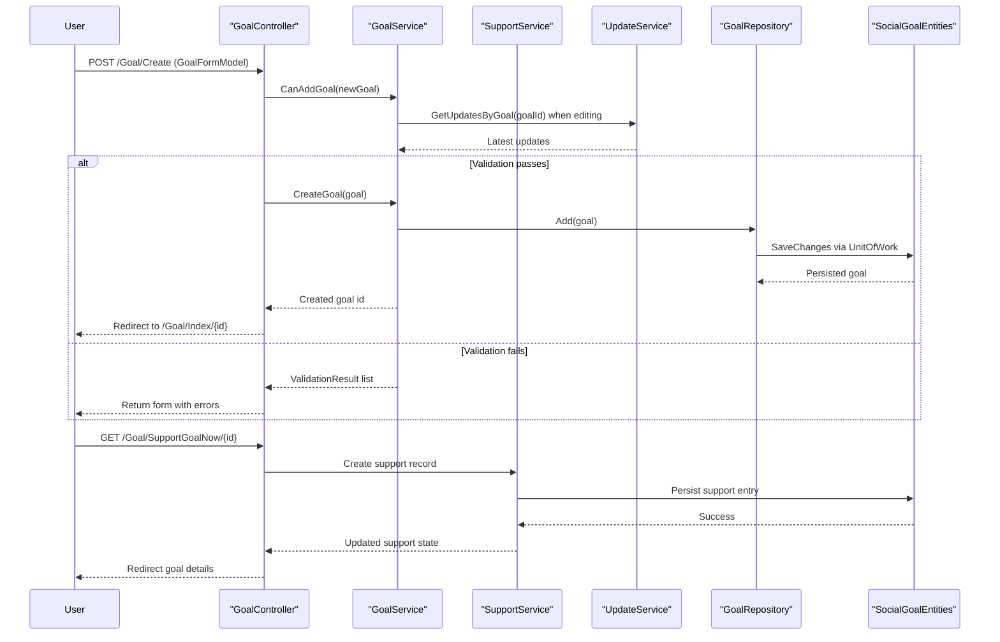

# API & Service Communication Contracts

The SocialGoal web application exposes a broad MVC endpoint surface for account, goal, group, notification, and search workflows using synchronous in-process service calls.

## Service Catalog

| Service | Port | Category | Purpose |
|---|---|---|---|
| SocialGoal.Web | IIS/IIS Express (not hardcoded in repo) | API Layer | Main MVC application hosting user-facing endpoints |
| SocialGoal.Service | In-process library | Business | Implements domain services for goals, groups, users, supports, comments |
| SocialGoal.Data | In-process library | Business | Repository and unit-of-work persistence abstraction over EF6 |
| SocialGoal.Web.Core | In-process library | Infrastructure | Shared MVC helpers, filters, authentication abstractions |

## API Endpoints Inventory

| Service | Method | Path | Request Type | Response Type |
|---|---|---|---|---|
| AccountController | GET | `/Account/Login` | Query: `returnUrl` | Login view |
| AccountController | POST | `/Account/Login` | `LoginViewModel` | Redirect or login view with errors |
| AccountController | POST | `/Account/Register` | `RegisterViewModel` | Redirect to home/email request or register view |
| AccountController | GET | `/Account/UserProfile/{id}` | Path/query: user id | `UserProfile` view |
| GoalController | GET | `/Goal/Index/{id}` | Path: goal id | `GoalViewModel` view |
| GoalController | POST | `/Goal/Create` | `GoalFormModel` | Redirect to goal details or create view |
| GoalController | POST | `/Goal/SaveUpdate` | `UpdateFormModel` | Redirect to goal details |
| GoalController | POST | `/Goal/InviteEmail` | `InviteEmailFormModel` | Plain text status message |
| GroupController | GET | `/Group/Index/{id}` | Path: group id | `GroupViewModel` view |
| GroupController | POST | `/Group/CreateGroup` | `GroupFormModel` | Redirect to new group or form view |
| GroupController | POST | `/Group/SaveComment` | `GroupCommentFormModel` | Redirect to group goal page |
| GroupController | POST | `/Group/InviteEmail` | `InviteEmailFormModel` | Plain text status message |
| EmailRequestController | GET | `/EmailRequest/AddGroupUser` | Session token context | Redirect to home |
| EmailRequestController | GET | `/EmailRequest/AddSupportToGoal` | Session token context | Redirect to home |
| NotificationController | GET | `/Notification/Index` | Query: page | Notification list view |
| SearchController | GET | `/Search/SearchAll` | Query: search text | Search results view |

## Management & Observability Endpoints

| Service | Endpoint | Custom Metrics (if any) |
|---|---|---|
| SocialGoal.Web | None explicitly configured (`/health`, `/swagger`, actuator-style endpoints not found) | None found |
| SocialGoal.Web | ELMAH route (`elmah`) configured via app settings | Error logging only; no metrics endpoint |

## DTOs & Contracts

Request/response contracts are primarily MVC view models in `SocialGoal\ViewModels` (for example `GoalFormModel`, `UpdateFormModel`, `GroupFormModel`, `InviteEmailFormModel`, `UserProfileFormModel`) mapped to domain entities via AutoMapper profiles. Service-level domain entities are under `SocialGoal.Model\Models` and are returned to views through mapped view models. DTOs are mutable C# classes rather than records/immutable types. Serialization dependencies include Newtonsoft.Json and the default ASP.NET MVC model binder; no OpenAPI/Swagger, protobuf, or GraphQL contracts were found.

## Communication Patterns

Communication is synchronous request-response: browser requests hit MVC controllers, which invoke injected service interfaces; services call repositories and commit via unit-of-work. Asynchronous messaging infrastructure (queue/event bus) was not found. Circuit-breaker/retry libraries and explicit timeout policies are not present. Service discovery and API gateway components are not present because modules run in-process within a single web application. API-level security is implemented via cookie authentication and `[Authorize]`; TLS enforcement is not explicitly configured in repository configuration files.

## Service Technology Matrix

| Service | Web | Data Access | Discovery | Gateway | Actuator | Cache | Metrics |
|---|---|---|---|---|---|---|---|
| SocialGoal.Web | ASP.NET MVC 5 + Razor | Via injected services | None | None | None | Session-based temporary token context | None |
| SocialGoal.Service | N/A (library) | Repository interfaces + UnitOfWork | None | None | None | None detected | None |
| SocialGoal.Data | N/A (library) | Entity Framework 6 (`SocialGoalEntities`) | None | None | None | None detected | None |
| SocialGoal.Web.Core | MVC filters/helpers | None | None | None | None | None detected | None |

## Service Communication Sequence

