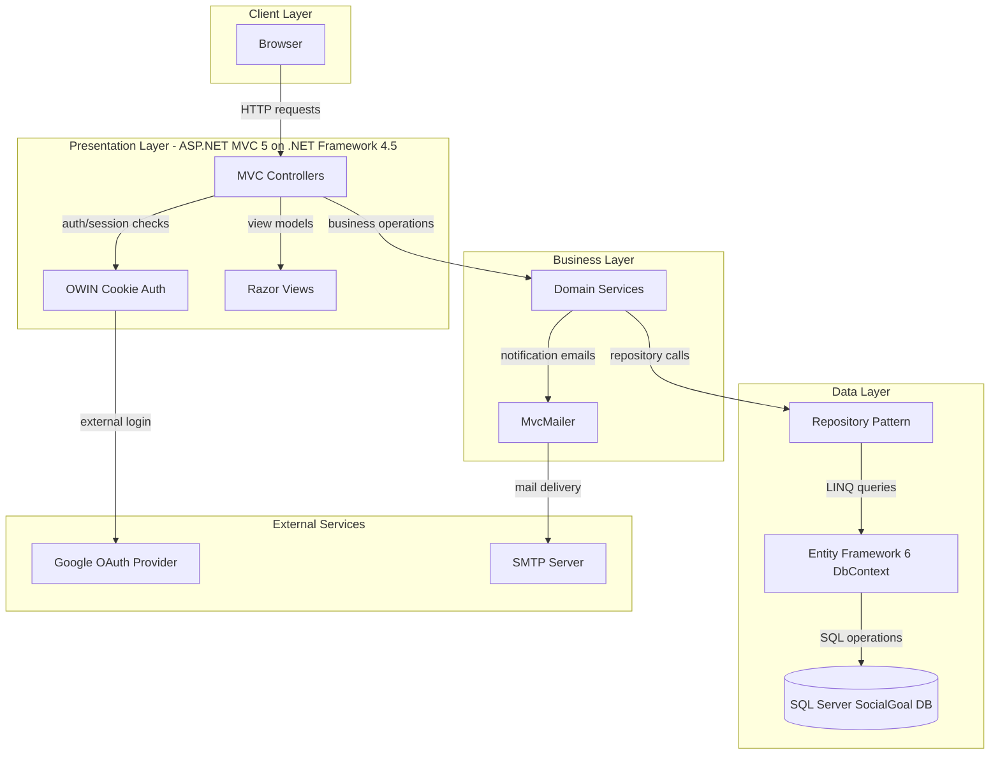
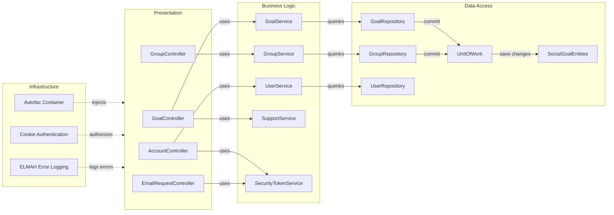

# Architecture Diagram

This document summarizes the SocialGoal solution architecture and the primary component interactions across presentation, service, and persistence layers.

## Application Architecture

### Technology Stack Summary

| Layer | Technology | Version | Purpose |
|---|---|---|---|
| Presentation | ASP.NET MVC, Razor, OWIN | MVC 5.0.0, OWIN 2.0.0 | Web UI, routing, auth pipeline |
| Business Logic | SocialGoal.Service | .NET Framework 4.5 class library | Domain operations and validation |
| Data Access | Entity Framework, Repository pattern | EF 6.0.x | Persistence and query abstraction |
| Data Store | SQL Server provider (`System.Data.SqlClient`) | SQL Server (configured connection string) | Primary relational storage |
| Integration | MvcMailer, Google OAuth | MvcMailer 4.5, OWIN Google auth | Email notifications and external sign-in |

### Data Storage & External Services

The application uses a single SQL Server database through `SocialGoalEntities` with many `DbSet<>`-backed domain aggregates. External dependencies include Google authentication through OWIN middleware and SMTP settings for email sending through MvcMailer.

### Key Architectural Decisions

- Uses Autofac registration-by-convention to wire controllers, repositories, services, and authentication abstractions per HTTP request.
- Uses layered projects (`Web` → `Service` → `Data`/`Model`) with repository and unit-of-work patterns to isolate data access.
- Uses ASP.NET Identity with `IdentityDbContext<ApplicationUser>` integrated into the same EF context as domain entities.

## Component Relationships

### Component Inventory

| Component | Layer | Type | Responsibility |
|---|---|---|---|
| AccountController | Presentation | MVC Controller | Authentication, profile, follow workflows |
| GoalController | Presentation | MVC Controller | Goal CRUD, updates, supports, invitations |
| GroupController | Presentation | MVC Controller | Group lifecycle, membership, group goals/updates |
| EmailRequestController | Presentation | MVC Controller | Token-based join/support acceptance |
| GoalService | Business Logic | Domain Service | Goal validation, retrieval, pagination and lifecycle |
| GroupService | Business Logic | Domain Service | Group creation, membership linkage, filtering |
| SupportService | Business Logic | Domain Service | Goal support and supporter retrieval |
| SecurityTokenService | Business Logic | Domain Service | Invitation/security token mapping and lifecycle |
| GoalRepository | Data Access | Repository | Goal query specialization (`GetGoalsByPage`) |
| GroupRepository | Data Access | Repository | Group entity persistence |
| UnitOfWork | Data Access | Unit of Work | Commits EF context changes |
| SocialGoalEntities | Data Access | EF DbContext | Identity plus domain aggregate persistence |
