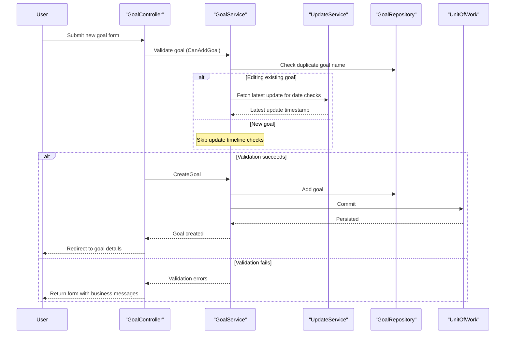

# Core Business Workflows

SocialGoal supports social accountability workflows where users create goals, post updates, invite supporters, and collaborate in groups through shared progress tracking.

## Domain Entities

| Entity | Service / Bounded Context | Description | Key Relationships |
|---|---|---|---|
| ApplicationUser | Account Management | Authenticated user identity used across all workflows | Owns goals, follows users, joins groups |
| UserProfile | Account Management | Extended profile information shown on user pages | One-to-one with ApplicationUser |
| Goal | Personal Goal Management | Individual target created by a user | Has updates, comments, supports, status, metric |
| Update | Goal Progress Tracking | Time-stamped progress record for a goal | Belongs to a goal; has comments and supporter reactions |
| Group | Group Collaboration | Shared space for multiple users and group goals | Has members, requests, invitations, group goals |
| GroupGoal / GroupUpdate | Group Progress Tracking | Goal and update artifacts scoped to a group | GroupGoal has GroupUpdates and supporter activity |
| FollowRequest / FollowUser | Social Graph | Request and accepted relationships between users | Drives followed-goal and followed-group feeds |
| SecurityToken / Invitations | Invitation Flows | Tokenized join/support operations sent by email | Links email invitations to goal/group acceptance |

## Service-to-Domain Mapping

| Service | Domain Context | Owned Entities | External Dependencies |
|---|---|---|---|
| `UserService`, `UserProfileService`, `Follow*Service` | Account & Social Graph | ApplicationUser, UserProfile, FollowRequest, FollowUser | ASP.NET Identity, repositories |
| `GoalService`, `UpdateService`, `SupportService`, `CommentService` | Personal Goals | Goal, Update, Support, Comment, UpdateSupport | Goal/update repositories, unit-of-work |
| `GroupService`, `GroupGoalService`, `GroupUpdateServices`, `GroupUserService` | Group Collaboration | Group, GroupGoal, GroupUpdate, GroupUser, GroupRequest, GroupInvitation | Group repositories, follow services |
| `SecurityTokenService`, `SupportInvitationService`, `GroupInvitationService` | Invitation & Onboarding | SecurityToken, invitation entities | Email request controller and mailers |

## Primary Workflows

### Workflow 1: Create and Track a Personal Goal

A logged-in user opens goal creation, submits goal details, and the system validates uniqueness and date windows. `GoalService.CanAddGoal` enforces duplicate-name and timeline checks before persistence. After creation, users post updates and comments, and supporters can interact with those updates.

### Workflow 2: Create and Manage a Group

A user creates a group, and `GroupService.CreateGroup` persists the group then automatically creates an admin `GroupUser` membership record. Group admins add goals, capture group updates, and review incoming join requests, accepting or rejecting members via controller actions.

### Workflow 3: Invitation-Based Join/Support Flow

Invitation links carry token references for group join or goal support. During login/registration, session state stores pending token context; `EmailRequestController` resolves token-to-entity mapping through `SecurityTokenService`, creates membership/support records, and invalidates used tokens.

## Cross-Service Data Flows

Cross-domain flows are orchestrated inside one web app using injected services rather than remote service calls. For example, goal pages combine goal data (`GoalService`), support state (`SupportService`), updates (`UpdateService`), and comment/supporter projections before rendering. Invitation workflows bridge account services with group/goal services by decoding token references and creating relationship records. When validation fails (duplicate goal/group, invalid dates), workflows degrade gracefully by returning form views with model errors instead of mutating state.

## Business Workflow Sequence

## Business Rules & Decision Logic

- Goal rules: goal name must be unique per system scope checked by repository; end date cannot be before start date; edited goal dates must remain consistent with existing updates.
- Group rules: group name uniqueness is enforced before create/update; group creator is automatically assigned as admin member.
- Invitation rules: invitation tokens must resolve to a valid target entity, and tokens are deleted after successful acceptance to prevent reuse.
- Relationship rules: follow requests transition into follow relationships through explicit accept/reject actions.
- Authorization rules: most controllers require authenticated users through `[Authorize]`; anonymous access is limited to account sign-in and registration entry points.
- Transaction handling: writes are persisted through unit-of-work commit boundaries after repository operations.
