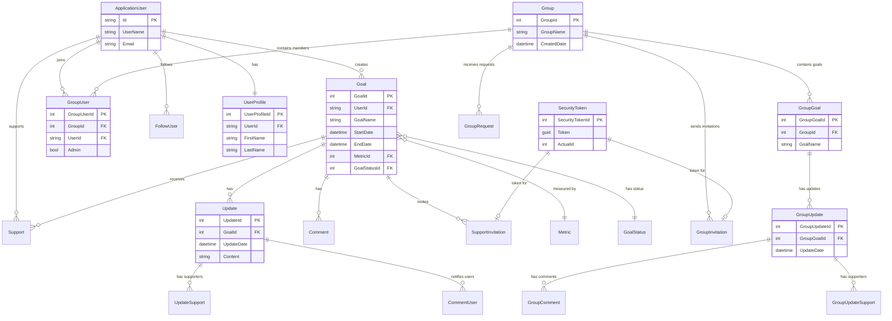

# Data Architecture & Persistence Layer

The SocialGoal solution uses Entity Framework 6 with a single SQL Server-backed `SocialGoalEntities` context that stores both identity and business-domain data.

## Database Configuration

| Service/Module | DB Type | Profile | Driver | Connection | Migration Tool |
|---|---|---|---|---|---|
| SocialGoal.Web | SQL Server | Default (web.config) | `System.Data.SqlClient` / EF SQL provider | `Data Source=.\;Initial Catalog=SocialGoal;Integrated Security=True` | EF code-first model configuration (no explicit migrations found) |
| SocialGoal.Data | SQL Server provider registration | Default | `EntityFramework.SqlServer` | Inherits connection named `SocialGoalEntities` | None explicitly declared |
| SocialGoal.Tests | SQL Server provider registration for tests | Test runtime | `EntityFramework.SqlServer` | Uses default connection factory unless overridden | None explicitly declared |

## Data Ownership per Service

| Service | Tables Owned | ORM Framework | Caching | Notes |
|---|---|---|---|---|
| SocialGoal.Data | Goal, Update, Comment, Support, Group, GroupGoal, GroupUpdate, Follow*, UserProfile, SecurityToken, Metric, Identity tables | Entity Framework 6 | None detected | Central persistence module with repository and UoW abstractions |
| SocialGoal.Web / Service layer | No direct table ownership; orchestrates domain writes via repositories | N/A (consumes EF repositories) | Session key (`JoinGroupOrGoal`) only | Business layer treated as source of write orchestration rules |

## Entity Model

## Key Repository Methods

| Service | Repository | Notable Methods | Purpose |
|---|---|---|---|
| SocialGoal.Data | `GoalRepository` (`Repository/GoalRepository.cs`) | `GetGoalsByPage(string userId, int currentPage, int noOfRecords, string sortBy, string filterBy)` | Supports paginated goal listings with user-aware filter and popularity/date sorting |
| SocialGoal.Data | `RepositoryBase<T>` (`Infrastructure/RepositoryBase.cs`) | `GetPage<TOrder>(Page page, Expression<Func<T,bool>> where, Expression<Func<T,TOrder>> order)` | Shared paging abstraction used by higher-level repositories |
| SocialGoal.Data | `RepositoryBase<T>` | `GetMany`, `Get`, `GetById`, `Add`, `Update`, `Delete` | Core CRUD and query operations for all aggregate repositories |
| SocialGoal.Data | `GroupRepository` and peers | Inherit base methods (no extra signatures) | Entity-specific repositories relying on generic repository contract |

## Caching Strategy

No dedicated distributed or in-memory data caching provider (Redis, MemoryCache, EF second-level cache) was found in repository configuration. The only observed short-lived cache-like behavior is ASP.NET session state use for invitation tokens (`JoinGroupOrGoal`) to bridge login and acceptance flows. Persistence reads/writes are performed directly through EF queries.

## Data Ownership Boundaries

The solution uses a shared-database monolith pattern. All domain contexts (accounts, goals, groups, comments, follows, notifications) share one SQL Server schema through the same `SocialGoalEntities` context. Cross-context access occurs through in-process service calls and repository queries rather than inter-service API calls. Read and write paths are coupled to the same database and transaction boundary (`UnitOfWork.Commit`), so CQRS separation is not present.

### Data Classification & Sensitivity

| Entity | Sensitive Fields | Classification (PII/PHI/PCI/None) | Controls in Place |
|---|---|---|---|
| ApplicationUser | UserName, Email | PII | ASP.NET Identity auth; no field-level masking/encryption in repo config |
| UserProfile | FirstName, LastName, profile attributes | PII | Authorization via `[Authorize]`; no explicit encryption-at-rest config in code |
| Goal / Group content | User-generated text and status data | Potential PII (free text) | Access controlled at application layer; no masking controls detected |
| Support / Follow / GroupUser | User relationship links (`UserId`) | PII linkage | Stored in relational tables without explicit masking in repository |
| Payment or health entities | Not found | None | No PCI/PHI-specific model detected |
