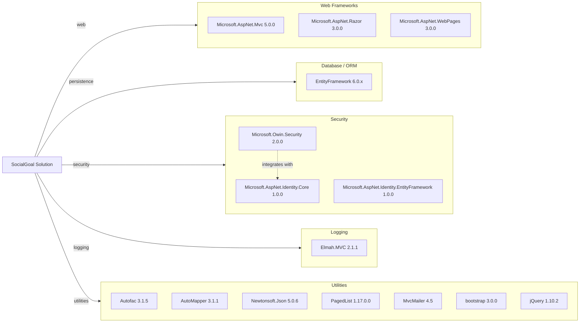

# Dependency Map

This dependency map summarizes declared package dependencies across the SocialGoal .NET solution (excluding test-scope dependencies in the main map).

## Dependencies

### Dependency Summary

| Category | Count | Key Libraries | Notes |
|---|---:|---|---|
| Web Frameworks | 3 | ASP.NET MVC, Razor, WebPages | Legacy ASP.NET MVC 5 stack on .NET Framework |
| Database / ORM | 1 | EntityFramework 6.0.x | EF6 code-first mapping via `DbContext` |
| Security | 3 | ASP.NET Identity, OWIN Security | Cookie auth + external login middleware |
| Logging | 1 | Elmah.MVC | Error capture via ELMAH modules |
| Utilities | 8 | Autofac, AutoMapper, Newtonsoft.Json, PagedList | Mix of DI, mapping, serialization, paging, UI libs |

### Version & Compatibility Risks

The solution targets .NET Framework 4.5 and uses older package versions (for example ASP.NET Identity 1.0.0 and Newtonsoft.Json 5.0.6), which can introduce compatibility and security risk during platform modernization. EF6 has a migration path but requires API and behavior review for EF Core parity.

### Notable Observations

- Dependency versions differ slightly across projects (for example EntityFramework 6.0.1 in data project vs 6.0.2-beta1 in web package manifest).
- OWIN middleware and ASP.NET Identity are tightly coupled to legacy ASP.NET MVC request pipeline.
- Multiple client-side packages are pinned to older major versions, increasing frontend modernization scope.
- No dedicated observability/telemetry dependency (for example OpenTelemetry or App Insights) is declared.

## Test Dependencies

| Framework | Version | Notes |
|---|---|---|
| NUnit | 2.6.3 | Primary unit test framework in `SocialGoal.Tests` |
| Moq | 4.1.1311.0615 | Mocking library for controller/service tests |

Total test-scope dependencies: 2

Test infrastructure is based on classic .NET Framework unit testing (NUnit + Moq) and does not include newer integration/containerized test tooling.
