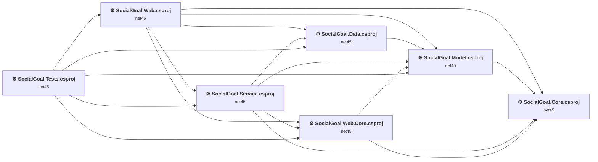
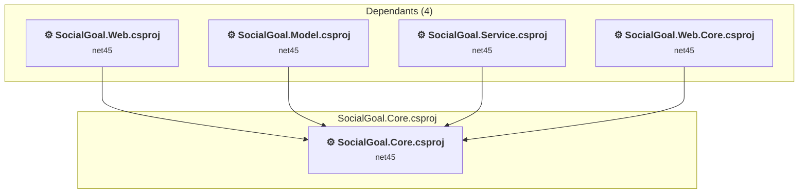
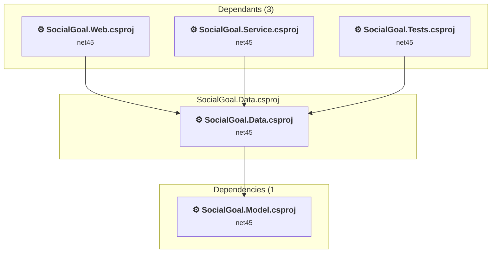
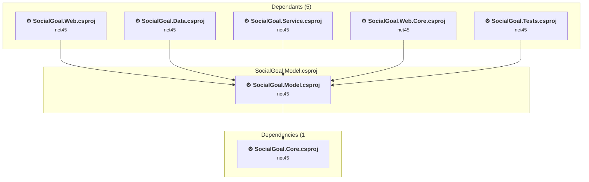
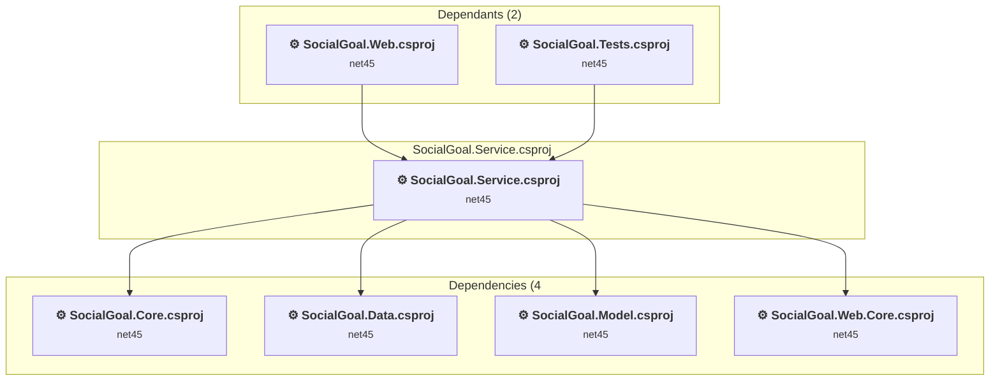
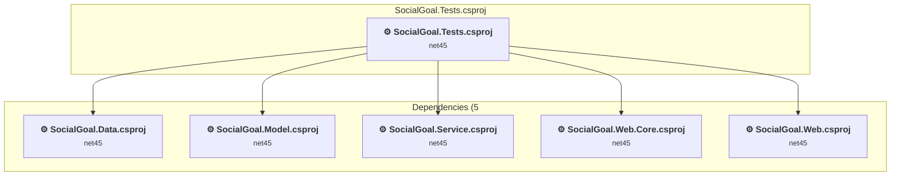
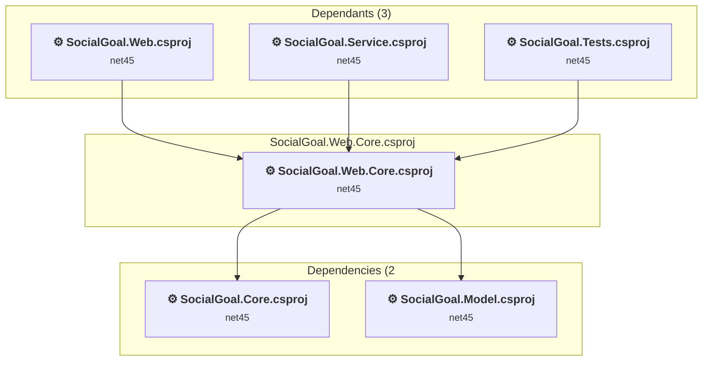
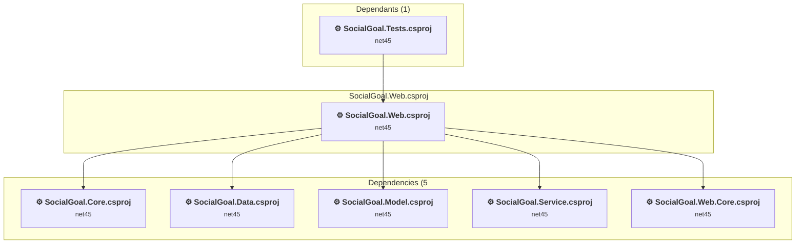

# Projects and dependencies analysis

This document provides a comprehensive overview of the projects and their dependencies in the context of upgrading to .NETCoreApp,Version=v10.0.

## Table of Contents

- [Executive Summary](#executive-Summary)
  - [Highlevel Metrics](#highlevel-metrics)
  - [Projects Compatibility](#projects-compatibility)
  - [Package Compatibility](#package-compatibility)
  - [API Compatibility](#api-compatibility)
  - [Binding Redirect Configuration](#binding-redirect-configuration)
- [Aggregate NuGet packages details](#aggregate-nuget-packages-details)
- [Top API Migration Challenges](#top-api-migration-challenges)
  - [Technologies and Features](#technologies-and-features)
  - [Most Frequent API Issues](#most-frequent-api-issues)
- [Projects Relationship Graph](#projects-relationship-graph)
- [Project Details](#project-details)

  - [SocialGoal.Core\SocialGoal.Core.csproj](#socialgoalcoresocialgoalcorecsproj)
  - [SocialGoal.Data\SocialGoal.Data.csproj](#socialgoaldatasocialgoaldatacsproj)
  - [SocialGoal.Model\SocialGoal.Model.csproj](#socialgoalmodelsocialgoalmodelcsproj)
  - [SocialGoal.Service\SocialGoal.Service.csproj](#socialgoalservicesocialgoalservicecsproj)
  - [SocialGoal.Tests\SocialGoal.Tests.csproj](#socialgoaltestssocialgoaltestscsproj)
  - [SocialGoal.Web.Core\SocialGoal.Web.Core.csproj](#socialgoalwebcoresocialgoalwebcorecsproj)
  - [SocialGoal\SocialGoal.Web.csproj](#socialgoalsocialgoalwebcsproj)

## Executive Summary

### Highlevel Metrics

| Metric | Count | Status |
| :--- | :---: | :--- |
| Total Projects | 7 | All require upgrade |
| Total NuGet Packages | 41 | 29 need upgrade |
| Total Code Files | 313 |  |
| Total Code Files with Incidents | 31 |  |
| Total Lines of Code | 25494 |  |
| Total Number of Issues | 737 |  |
| Estimated LOC to modify | 642+ | at least 2.5% of codebase |

### Projects Compatibility

| Project | Target Framework | Difficulty | Package Issues | API Issues | Binding Issues | Est. LOC Impact | Description |
| :--- | :---: | :---: | :---: | :---: | :---: | :---: | :--- |
| [SocialGoal.Core\SocialGoal.Core.csproj](#socialgoalcoresocialgoalcorecsproj) | net45 | 🟢 Low | 0 | 0 | 1 |  | ClassicClassLibrary, Sdk Style = False |
| [SocialGoal.Data\SocialGoal.Data.csproj](#socialgoaldatasocialgoaldatacsproj) | net45 | 🟢 Low | 3 | 0 | 1 |  | ClassicClassLibrary, Sdk Style = False |
| [SocialGoal.Model\SocialGoal.Model.csproj](#socialgoalmodelsocialgoalmodelcsproj) | net45 | 🟢 Low | 0 | 3 | 1 | 3+ | ClassicClassLibrary, Sdk Style = False |
| [SocialGoal.Service\SocialGoal.Service.csproj](#socialgoalservicesocialgoalservicecsproj) | net45 | 🟢 Low | 1 | 0 | 1 |  | ClassicClassLibrary, Sdk Style = False |
| [SocialGoal.Tests\SocialGoal.Tests.csproj](#socialgoaltestssocialgoaltestscsproj) | net45 | 🟡 Medium | 13 | 510 | 1 | 510+ | ClassicClassLibrary, Sdk Style = False |
| [SocialGoal.Web.Core\SocialGoal.Web.Core.csproj](#socialgoalwebcoresocialgoalwebcorecsproj) | net45 | 🟢 Low | 2 | 56 | 1 | 56+ | ClassicClassLibrary, Sdk Style = False |
| [SocialGoal\SocialGoal.Web.csproj](#socialgoalsocialgoalwebcsproj) | net45 | 🔴 High | 45 | 73 | 0 | 73+ | Wap, Sdk Style = False |

### Package Compatibility

| Status | Count | Percentage |
| :--- | :---: | :---: |
| ✅ Compatible | 12 | 29.3% |
| ⚠️ Incompatible | 22 | 53.7% |
| 🔄 Upgrade Recommended | 7 | 17.1% |
| ***Total NuGet Packages*** | ***41*** | ***100%*** |

### API Compatibility

| Category | Count | Impact |
| :--- | :---: | :--- |
| 🔴 Binary Incompatible | 371 | High - Require code changes |
| 🟡 Source Incompatible | 268 | Medium - Needs re-compilation and potential conflicting API error fixing |
| 🔵 Behavioral change | 3 | Low - Behavioral changes that may require testing at runtime |
| ✅ Compatible | 14076 |  |
| ***Total APIs Analyzed*** | ***14718*** |  |

### Binding Redirect Configuration

| Severity | Count | Description |
| :--- | :---: | :--- |
| 🟡Potential | 6 | May cause issues in certain scenarios |
| ***Total Binding Issues*** | ***6*** | ***Across 6 project(s)*** |

## Aggregate NuGet packages details

| Package | Current Version | Suggested Version | Projects | Description |
| :--- | :---: | :---: | :--- | :--- |
| Antlr | 3.4.1.9004 |  | [SocialGoal.Web.csproj](#socialgoalsocialgoalwebcsproj) | Needs to be replaced with Replace with new package Antlr4=4.6.6 |
| Autofac | 3.1.5 | 9.2.0 | [SocialGoal.Web.csproj](#socialgoalsocialgoalwebcsproj) | ⚠️NuGet package is incompatible |
| Autofac.Mvc5 | 3.0.0 |  | [SocialGoal.Web.csproj](#socialgoalsocialgoalwebcsproj) | ⚠️NuGet package is incompatible |
| AutoMapper | 3.1.1-ci1000 | 16.1.1 | [SocialGoal.Tests.csproj](#socialgoaltestssocialgoaltestscsproj) [SocialGoal.Web.Core.csproj](#socialgoalwebcoresocialgoalwebcorecsproj) [SocialGoal.Web.csproj](#socialgoalsocialgoalwebcsproj) | ⚠️NuGet package is incompatible |
| bootstrap | 3.0.0 | 5.3.8 | [SocialGoal.Web.csproj](#socialgoalsocialgoalwebcsproj) | NuGet package contains security vulnerability |
| elmah.corelibrary | 1.2.2 |  | [SocialGoal.Web.csproj](#socialgoalsocialgoalwebcsproj) | ✅Compatible |
| Elmah.MVC | 2.1.1 | 1.3.2 | [SocialGoal.Web.csproj](#socialgoalsocialgoalwebcsproj) | ⚠️NuGet package is incompatible |
| EntityFramework | 6.0.0 | 6.5.2 | [SocialGoal.Tests.csproj](#socialgoaltestssocialgoaltestscsproj) | NuGet package upgrade is recommended |
| EntityFramework | 6.0.1 | 6.5.2 | [SocialGoal.Data.csproj](#socialgoaldatasocialgoaldatacsproj) | NuGet package upgrade is recommended |
| EntityFramework | 6.0.2-beta1 | 6.5.2 | [SocialGoal.Web.csproj](#socialgoalsocialgoalwebcsproj) | NuGet package upgrade is recommended |
| jQuery | 1.10.2 | 3.7.1 | [SocialGoal.Web.csproj](#socialgoalsocialgoalwebcsproj) | NuGet package contains security vulnerability |
| jQuery.Validation | 1.11.1 | 1.21.0 | [SocialGoal.Web.csproj](#socialgoalsocialgoalwebcsproj) | NuGet package contains security vulnerability |
| Microsoft.AspNet.Identity.Core | 1.0.0 |  | [SocialGoal.Tests.csproj](#socialgoaltestssocialgoaltestscsproj) [SocialGoal.Web.csproj](#socialgoalsocialgoalwebcsproj) | ⚠️NuGet package is incompatible |
| Microsoft.AspNet.Identity.EntityFramework | 1.0.0 |  | [SocialGoal.Tests.csproj](#socialgoaltestssocialgoaltestscsproj) [SocialGoal.Web.csproj](#socialgoalsocialgoalwebcsproj) | ⚠️NuGet package is incompatible |
| Microsoft.AspNet.Identity.Owin | 1.0.0 |  | [SocialGoal.Web.csproj](#socialgoalsocialgoalwebcsproj) | ⚠️NuGet package is incompatible |
| Microsoft.AspNet.Mvc | 5.0.0 |  | [SocialGoal.Web.csproj](#socialgoalsocialgoalwebcsproj) | NuGet package functionality is included with framework reference |
| Microsoft.AspNet.Razor | 3.0.0 |  | [SocialGoal.Web.csproj](#socialgoalsocialgoalwebcsproj) | NuGet package functionality is included with framework reference |
| Microsoft.AspNet.Web.Optimization | 1.1.1 |  | [SocialGoal.Web.csproj](#socialgoalsocialgoalwebcsproj) | ⚠️NuGet package is incompatible |
| Microsoft.AspNet.WebPages | 3.0.0 |  | [SocialGoal.Web.csproj](#socialgoalsocialgoalwebcsproj) | NuGet package functionality is included with framework reference |
| Microsoft.jQuery.Unobtrusive.Validation | 3.0.0 |  | [SocialGoal.Web.csproj](#socialgoalsocialgoalwebcsproj) | ✅Compatible |
| Microsoft.Owin | 2.0.0 |  | [SocialGoal.Tests.csproj](#socialgoaltestssocialgoaltestscsproj) [SocialGoal.Web.csproj](#socialgoalsocialgoalwebcsproj) | ⚠️NuGet package is incompatible |
| Microsoft.Owin.Host.SystemWeb | 2.0.0 |  | [SocialGoal.Web.csproj](#socialgoalsocialgoalwebcsproj) | ⚠️NuGet package is incompatible |
| Microsoft.Owin.Security | 2.0.0 |  | [SocialGoal.Tests.csproj](#socialgoaltestssocialgoaltestscsproj) [SocialGoal.Web.csproj](#socialgoalsocialgoalwebcsproj) | ⚠️NuGet package is incompatible |
| Microsoft.Owin.Security.Cookies | 2.0.0 |  | [SocialGoal.Web.csproj](#socialgoalsocialgoalwebcsproj) | ⚠️Replace with Microsoft.AspNetCore.Authentication.Cookies: Use AddAuthentication().AddCookie() in Startup; adjust cookie options |
| Microsoft.Owin.Security.Facebook | 2.0.0 |  | [SocialGoal.Web.csproj](#socialgoalsocialgoalwebcsproj) | ⚠️NuGet package is incompatible |
| Microsoft.Owin.Security.Google | 2.0.0 |  | [SocialGoal.Web.csproj](#socialgoalsocialgoalwebcsproj) | ⚠️NuGet package is incompatible |
| Microsoft.Owin.Security.MicrosoftAccount | 2.0.0 |  | [SocialGoal.Web.csproj](#socialgoalsocialgoalwebcsproj) | ⚠️NuGet package is incompatible |
| Microsoft.Owin.Security.OAuth | 2.0.0 |  | [SocialGoal.Web.csproj](#socialgoalsocialgoalwebcsproj) | ⚠️Replace with Microsoft.AspNetCore.Authentication.JwtBearer: Use JWT Bearer for token validation; adopt IdentityServer or Azure AD for issuing tokens |
| Microsoft.Owin.Security.Twitter | 2.0.0 |  | [SocialGoal.Web.csproj](#socialgoalsocialgoalwebcsproj) | ⚠️NuGet package is incompatible |
| Microsoft.Web.Infrastructure | 1.0.0.0 |  | [SocialGoal.Web.csproj](#socialgoalsocialgoalwebcsproj) | NuGet package functionality is included with framework reference |
| Modernizr | 2.6.2 |  | [SocialGoal.Web.csproj](#socialgoalsocialgoalwebcsproj) | ✅Compatible |
| Moq | 4.1.1311.0615 | 4.20.72 | [SocialGoal.Tests.csproj](#socialgoaltestssocialgoaltestscsproj) | ⚠️NuGet package is incompatible |
| MvcMailer | 4.5 |  | [SocialGoal.Tests.csproj](#socialgoaltestssocialgoaltestscsproj) [SocialGoal.Web.csproj](#socialgoalsocialgoalwebcsproj) | ⚠️NuGet package is incompatible |
| Newtonsoft.Json | 5.0.6 | 13.0.4 | [SocialGoal.Web.csproj](#socialgoalsocialgoalwebcsproj) | NuGet package upgrade is recommended |
| NUnit | 2.6.3 |  | [SocialGoal.Tests.csproj](#socialgoaltestssocialgoaltestscsproj) | ✅Compatible |
| Owin | 1.0 |  | [SocialGoal.Tests.csproj](#socialgoaltestssocialgoaltestscsproj) [SocialGoal.Web.csproj](#socialgoalsocialgoalwebcsproj) | ⚠️NuGet package is incompatible |
| PagedList | 1.17.0.0 |  | [SocialGoal.Data.csproj](#socialgoaldatasocialgoaldatacsproj) [SocialGoal.Service.csproj](#socialgoalservicesocialgoalservicecsproj) [SocialGoal.Web.Core.csproj](#socialgoalwebcoresocialgoalwebcorecsproj) [SocialGoal.Web.csproj](#socialgoalsocialgoalwebcsproj) | ⚠️NuGet package is incompatible |
| PagedList.Mvc | 4.5.0.0 |  | [SocialGoal.Web.csproj](#socialgoalsocialgoalwebcsproj) | ⚠️NuGet package is incompatible |
| Respond | 1.2.0 |  | [SocialGoal.Web.csproj](#socialgoalsocialgoalwebcsproj) | ✅Compatible |
| T4Scaffolding.Core | 1.0.0 |  | [SocialGoal.Tests.csproj](#socialgoaltestssocialgoaltestscsproj) [SocialGoal.Web.csproj](#socialgoalsocialgoalwebcsproj) | ✅Compatible |
| WebGrease | 1.5.2 |  | [SocialGoal.Web.csproj](#socialgoalsocialgoalwebcsproj) | ✅Compatible |

## Top API Migration Challenges

### Technologies and Features

| Technology | Issues | Percentage | Migration Path |
| :--- | :---: | :---: | :--- |
| ASP.NET Framework (System.Web) | 605 | 94.2% | Legacy ASP.NET Framework APIs for web applications (System.Web.*) that don't exist in ASP.NET Core due to architectural differences. ASP.NET Core represents a complete redesign of the web framework. Migrate to ASP.NET Core equivalents or consider System.Web.Adapters package for compatibility. |
| GDI+ / System.Drawing | 33 | 5.1% | System.Drawing APIs for 2D graphics, imaging, and printing that are available via NuGet package System.Drawing.Common. Note: Not recommended for server scenarios due to Windows dependencies; consider cross-platform alternatives like SkiaSharp or ImageSharp for new code. |

### Most Frequent API Issues

| API | Count | Percentage | Category |
| :--- | :---: | :---: | :--- |
| T:System.Web.Security.FormsAuthenticationTicket | 89 | 13.9% | Binary Incompatible |
| T:System.Web.Security.FormsAuthentication | 87 | 13.6% | Binary Incompatible |
| P:System.Web.Security.FormsAuthentication.FormsCookieName | 42 | 6.5% | Binary Incompatible |
| T:System.Web.HttpCookieCollection | 42 | 6.5% | Source Incompatible |
| P:System.Web.HttpCookie.Value | 40 | 6.2% | Source Incompatible |
| M:System.Web.HttpCookieCollection.#ctor | 40 | 6.2% | Source Incompatible |
| P:System.Web.Security.FormsAuthentication.Timeout | 40 | 6.2% | Binary Incompatible |
| M:System.Web.Security.FormsAuthenticationTicket.#ctor(System.Int32,System.String,System.DateTime,System.DateTime,System.Boolean,System.String) | 40 | 6.2% | Binary Incompatible |
| T:System.Web.HttpContext | 25 | 3.9% | Source Incompatible |
| T:System.Web.SessionState.SessionStateMode | 10 | 1.6% | Source Incompatible |
| T:System.Web.HttpCookieMode | 10 | 1.6% | Binary Incompatible |
| T:System.Web.HttpPostedFileBase | 9 | 1.4% | Source Incompatible |
| P:System.Web.HttpContext.Current | 9 | 1.4% | Source Incompatible |
| T:System.Web.HttpResponse | 6 | 0.9% | Source Incompatible |
| T:System.Drawing.Bitmap | 6 | 0.9% | Source Incompatible |
| P:System.Web.HttpContext.Items | 5 | 0.8% | Source Incompatible |
| F:System.Web.SessionState.SessionStateMode.InProc | 5 | 0.8% | Source Incompatible |
| F:System.Web.HttpCookieMode.AutoDetect | 5 | 0.8% | Binary Incompatible |
| T:System.Web.HttpStaticObjectsCollection | 5 | 0.8% | Binary Incompatible |
| M:System.Web.HttpStaticObjectsCollection.#ctor | 5 | 0.8% | Binary Incompatible |
| T:System.Web.SessionState.SessionStateItemCollection | 5 | 0.8% | Binary Incompatible |
| M:System.Web.SessionState.SessionStateItemCollection.#ctor | 5 | 0.8% | Binary Incompatible |
| T:System.Web.SessionState.HttpSessionStateContainer | 5 | 0.8% | Binary Incompatible |
| M:System.Web.SessionState.HttpSessionStateContainer.#ctor(System.String,System.Web.SessionState.ISessionStateItemCollection,System.Web.HttpStaticObjectsCollection,System.Int32,System.Boolean,System.Web.HttpCookieMode,System.Web.SessionState.SessionStateMode,System.Boolean) | 5 | 0.8% | Binary Incompatible |
| M:System.Web.HttpContext.#ctor(System.Web.HttpRequest,System.Web.HttpResponse) | 5 | 0.8% | Binary Incompatible |
| M:System.Web.HttpResponse.#ctor(System.IO.TextWriter) | 5 | 0.8% | Binary Incompatible |
| T:System.Web.HttpRequest | 5 | 0.8% | Source Incompatible |
| M:System.Web.HttpRequest.#ctor(System.String,System.String,System.String) | 5 | 0.8% | Binary Incompatible |
| P:System.Web.HttpResponseBase.Filter | 4 | 0.6% | Source Incompatible |
| T:System.Web.SessionState.HttpSessionState | 4 | 0.6% | Source Incompatible |
| P:System.Web.HttpContext.Session | 4 | 0.6% | Source Incompatible |
| T:System.Drawing.Image | 4 | 0.6% | Source Incompatible |
| T:System.Drawing.Drawing2D.InterpolationMode | 3 | 0.5% | Source Incompatible |
| T:System.Drawing.Drawing2D.SmoothingMode | 3 | 0.5% | Source Incompatible |
| T:System.Xml.Serialization.XmlSerializer | 2 | 0.3% | Behavioral Change |
| P:System.Web.Security.FormsAuthenticationTicket.UserData | 2 | 0.3% | Binary Incompatible |
| P:System.Web.Security.FormsAuthenticationTicket.Name | 2 | 0.3% | Binary Incompatible |
| T:System.Web.HttpContextBase | 2 | 0.3% | Source Incompatible |
| P:System.Web.HttpCookie.Expires | 2 | 0.3% | Source Incompatible |
| T:System.Web.HttpCookie | 2 | 0.3% | Source Incompatible |
| M:System.Web.HttpCookie.#ctor(System.String,System.String) | 2 | 0.3% | Source Incompatible |
| M:System.Web.HttpCookieCollection.Add(System.Web.HttpCookie) | 2 | 0.3% | Source Incompatible |
| M:System.Web.Security.FormsAuthentication.Encrypt(System.Web.Security.FormsAuthenticationTicket) | 2 | 0.3% | Binary Incompatible |
| M:System.Web.HttpResponseBase.AppendHeader(System.String,System.String) | 2 | 0.3% | Source Incompatible |
| P:System.Web.SessionState.HttpSessionState.Item(System.String) | 2 | 0.3% | Source Incompatible |
| T:System.Drawing.GraphicsUnit | 2 | 0.3% | Source Incompatible |
| T:System.Drawing.Graphics | 2 | 0.3% | Source Incompatible |
| M:System.Drawing.Image.FromStream(System.IO.Stream) | 2 | 0.3% | Source Incompatible |
| T:System.Drawing.Imaging.ImageFormat | 2 | 0.3% | Source Incompatible |
| T:System.Web.Routing.RouteCollection | 2 | 0.3% | Binary Incompatible |

## Projects Relationship Graph

Legend:
📦 SDK-style project
⚙️ Classic project

## Project Details

### SocialGoal.Core\SocialGoal.Core.csproj

#### Project Info

- **Current Target Framework:** net45
- **Proposed Target Framework:** net10.0
- **SDK-style**: False
- **Project Kind:** ClassicClassLibrary
- **Dependencies**: 0
- **Dependants**: 4
- **Number of Files**: 2
- **Number of Files with Incidents**: 1
- **Lines of Code**: 88
- **Estimated LOC to modify**: 0+ (at least 0.0% of the project)

#### Dependency Graph

Legend:
📦 SDK-style project
⚙️ Classic project

### API Compatibility

| Category | Count | Impact |
| :--- | :---: | :--- |
| 🔴 Binary Incompatible | 0 | High - Require code changes |
| 🟡 Source Incompatible | 0 | Medium - Needs re-compilation and potential conflicting API error fixing |
| 🔵 Behavioral change | 0 | Low - Behavioral changes that may require testing at runtime |
| ✅ Compatible | 38 |  |
| ***Total APIs Analyzed*** | ***38*** |  |

#### Binding Redirect Configuration

| Rule | Severity | Details | Recommendation |
| :--- | :---: | :--- | :--- |
| AutoGenerateBindingRedirects not set and no manual redirects | 🟡Potential | AutoGenerateBindingRedirects is not set in SocialGoal.Core.csproj, no manual redirects found | Explicitly enable <AutoGenerateBindingRedirects>true</AutoGenerateBindingRedirects> or add manual binding redirects. |

### SocialGoal.Data\SocialGoal.Data.csproj

#### Project Info

- **Current Target Framework:** net45
- **Proposed Target Framework:** net10.0
- **SDK-style**: False
- **Project Kind:** ClassicClassLibrary
- **Dependencies**: 1
- **Dependants**: 3
- **Number of Files**: 61
- **Number of Files with Incidents**: 1
- **Lines of Code**: 1405
- **Estimated LOC to modify**: 0+ (at least 0.0% of the project)

#### Dependency Graph

Legend:
📦 SDK-style project
⚙️ Classic project

### API Compatibility

| Category | Count | Impact |
| :--- | :---: | :--- |
| 🔴 Binary Incompatible | 0 | High - Require code changes |
| 🟡 Source Incompatible | 0 | Medium - Needs re-compilation and potential conflicting API error fixing |
| 🔵 Behavioral change | 0 | Low - Behavioral changes that may require testing at runtime |
| ✅ Compatible | 374 |  |
| ***Total APIs Analyzed*** | ***374*** |  |

#### Binding Redirect Configuration

| Rule | Severity | Details | Recommendation |
| :--- | :---: | :--- | :--- |
| AutoGenerateBindingRedirects not set and no manual redirects | 🟡Potential | AutoGenerateBindingRedirects is not set in SocialGoal.Data.csproj, no manual redirects found | Explicitly enable <AutoGenerateBindingRedirects>true</AutoGenerateBindingRedirects> or add manual binding redirects. |

### SocialGoal.Model\SocialGoal.Model.csproj

#### Project Info

- **Current Target Framework:** net45
- **Proposed Target Framework:** net10.0
- **SDK-style**: False
- **Project Kind:** ClassicClassLibrary
- **Dependencies**: 1
- **Dependants**: 5
- **Number of Files**: 31
- **Number of Files with Incidents**: 2
- **Lines of Code**: 821
- **Estimated LOC to modify**: 3+ (at least 0.4% of the project)

#### Dependency Graph

Legend:
📦 SDK-style project
⚙️ Classic project

### API Compatibility

| Category | Count | Impact |
| :--- | :---: | :--- |
| 🔴 Binary Incompatible | 0 | High - Require code changes |
| 🟡 Source Incompatible | 3 | Medium - Needs re-compilation and potential conflicting API error fixing |
| 🔵 Behavioral change | 0 | Low - Behavioral changes that may require testing at runtime |
| ✅ Compatible | 870 |  |
| ***Total APIs Analyzed*** | ***873*** |  |

#### Binding Redirect Configuration

| Rule | Severity | Details | Recommendation |
| :--- | :---: | :--- | :--- |
| AutoGenerateBindingRedirects not set and no manual redirects | 🟡Potential | AutoGenerateBindingRedirects is not set in SocialGoal.Model.csproj, no manual redirects found | Explicitly enable <AutoGenerateBindingRedirects>true</AutoGenerateBindingRedirects> or add manual binding redirects. |

#### Project Technologies and Features

| Technology | Issues | Percentage | Migration Path |
| :--- | :---: | :---: | :--- |
| ASP.NET Framework (System.Web) | 3 | 100.0% | Legacy ASP.NET Framework APIs for web applications (System.Web.*) that don't exist in ASP.NET Core due to architectural differences. ASP.NET Core represents a complete redesign of the web framework. Migrate to ASP.NET Core equivalents or consider System.Web.Adapters package for compatibility. |

### SocialGoal.Service\SocialGoal.Service.csproj

#### Project Info

- **Current Target Framework:** net45
- **Proposed Target Framework:** net10.0
- **SDK-style**: False
- **Project Kind:** ClassicClassLibrary
- **Dependencies**: 4
- **Dependants**: 2
- **Number of Files**: 29
- **Number of Files with Incidents**: 1
- **Lines of Code**: 3515
- **Estimated LOC to modify**: 0+ (at least 0.0% of the project)

#### Dependency Graph

Legend:
📦 SDK-style project
⚙️ Classic project

### API Compatibility

| Category | Count | Impact |
| :--- | :---: | :--- |
| 🔴 Binary Incompatible | 0 | High - Require code changes |
| 🟡 Source Incompatible | 0 | Medium - Needs re-compilation and potential conflicting API error fixing |
| 🔵 Behavioral change | 0 | Low - Behavioral changes that may require testing at runtime |
| ✅ Compatible | 2577 |  |
| ***Total APIs Analyzed*** | ***2577*** |  |

#### Binding Redirect Configuration

| Rule | Severity | Details | Recommendation |
| :--- | :---: | :--- | :--- |
| AutoGenerateBindingRedirects not set and no manual redirects | 🟡Potential | AutoGenerateBindingRedirects is not set in SocialGoal.Service.csproj, no manual redirects found | Explicitly enable <AutoGenerateBindingRedirects>true</AutoGenerateBindingRedirects> or add manual binding redirects. |

### SocialGoal.Tests\SocialGoal.Tests.csproj

#### Project Info

- **Current Target Framework:** net45
- **Proposed Target Framework:** net10.0
- **SDK-style**: False
- **Project Kind:** ClassicClassLibrary
- **Dependencies**: 5
- **Dependants**: 0
- **Number of Files**: 10
- **Number of Files with Incidents**: 6
- **Lines of Code**: 5709
- **Estimated LOC to modify**: 510+ (at least 8.9% of the project)

#### Dependency Graph

Legend:
📦 SDK-style project
⚙️ Classic project

### API Compatibility

| Category | Count | Impact |
| :--- | :---: | :--- |
| 🔴 Binary Incompatible | 340 | High - Require code changes |
| 🟡 Source Incompatible | 170 | Medium - Needs re-compilation and potential conflicting API error fixing |
| 🔵 Behavioral change | 0 | Low - Behavioral changes that may require testing at runtime |
| ✅ Compatible | 4156 |  |
| ***Total APIs Analyzed*** | ***4666*** |  |

#### Binding Redirect Configuration

| Rule | Severity | Details | Recommendation |
| :--- | :---: | :--- | :--- |
| Library-hosted entry point missing GenerateBindingRedirectsOutputType | 🟡Potential | OutputType=Library with test framework references, GenerateBindingRedirectsOutputType not set | Add <GenerateBindingRedirectsOutputType>true</GenerateBindingRedirectsOutputType> so MSBuild generates redirects for library-hosted entry points. |

#### Project Technologies and Features

| Technology | Issues | Percentage | Migration Path |
| :--- | :---: | :---: | :--- |
| ASP.NET Framework (System.Web) | 510 | 100.0% | Legacy ASP.NET Framework APIs for web applications (System.Web.*) that don't exist in ASP.NET Core due to architectural differences. ASP.NET Core represents a complete redesign of the web framework. Migrate to ASP.NET Core equivalents or consider System.Web.Adapters package for compatibility. |

### SocialGoal.Web.Core\SocialGoal.Web.Core.csproj

#### Project Info

- **Current Target Framework:** net45
- **Proposed Target Framework:** net10.0
- **SDK-style**: False
- **Project Kind:** ClassicClassLibrary
- **Dependencies**: 2
- **Dependants**: 3
- **Number of Files**: 19
- **Number of Files with Incidents**: 6
- **Lines of Code**: 675
- **Estimated LOC to modify**: 56+ (at least 8.3% of the project)

#### Dependency Graph

Legend:
📦 SDK-style project
⚙️ Classic project

### API Compatibility

| Category | Count | Impact |
| :--- | :---: | :--- |
| 🔴 Binary Incompatible | 27 | High - Require code changes |
| 🟡 Source Incompatible | 27 | Medium - Needs re-compilation and potential conflicting API error fixing |
| 🔵 Behavioral change | 2 | Low - Behavioral changes that may require testing at runtime |
| ✅ Compatible | 406 |  |
| ***Total APIs Analyzed*** | ***462*** |  |

#### Binding Redirect Configuration

| Rule | Severity | Details | Recommendation |
| :--- | :---: | :--- | :--- |
| AutoGenerateBindingRedirects not set and no manual redirects | 🟡Potential | AutoGenerateBindingRedirects is not set in SocialGoal.Web.Core.csproj, no manual redirects found | Explicitly enable <AutoGenerateBindingRedirects>true</AutoGenerateBindingRedirects> or add manual binding redirects. |

#### Project Technologies and Features

| Technology | Issues | Percentage | Migration Path |
| :--- | :---: | :---: | :--- |
| ASP.NET Framework (System.Web) | 54 | 96.4% | Legacy ASP.NET Framework APIs for web applications (System.Web.*) that don't exist in ASP.NET Core due to architectural differences. ASP.NET Core represents a complete redesign of the web framework. Migrate to ASP.NET Core equivalents or consider System.Web.Adapters package for compatibility. |

### SocialGoal\SocialGoal.Web.csproj

#### Project Info

- **Current Target Framework:** net45
- **Proposed Target Framework:** net10.0
- **SDK-style**: False
- **Project Kind:** Wap
- **Dependencies**: 5
- **Dependants**: 1
- **Number of Files**: 413
- **Number of Files with Incidents**: 14
- **Lines of Code**: 13281
- **Estimated LOC to modify**: 73+ (at least 0.5% of the project)

#### Dependency Graph

Legend:
📦 SDK-style project
⚙️ Classic project

### API Compatibility

| Category | Count | Impact |
| :--- | :---: | :--- |
| 🔴 Binary Incompatible | 4 | High - Require code changes |
| 🟡 Source Incompatible | 68 | Medium - Needs re-compilation and potential conflicting API error fixing |
| 🔵 Behavioral change | 1 | Low - Behavioral changes that may require testing at runtime |
| ✅ Compatible | 5655 |  |
| ***Total APIs Analyzed*** | ***5728*** |  |

#### Project Technologies and Features

| Technology | Issues | Percentage | Migration Path |
| :--- | :---: | :---: | :--- |
| GDI+ / System.Drawing | 33 | 45.2% | System.Drawing APIs for 2D graphics, imaging, and printing that are available via NuGet package System.Drawing.Common. Note: Not recommended for server scenarios due to Windows dependencies; consider cross-platform alternatives like SkiaSharp or ImageSharp for new code. |
| ASP.NET Framework (System.Web) | 38 | 52.1% | Legacy ASP.NET Framework APIs for web applications (System.Web.*) that don't exist in ASP.NET Core due to architectural differences. ASP.NET Core represents a complete redesign of the web framework. Migrate to ASP.NET Core equivalents or consider System.Web.Adapters package for compatibility. |

