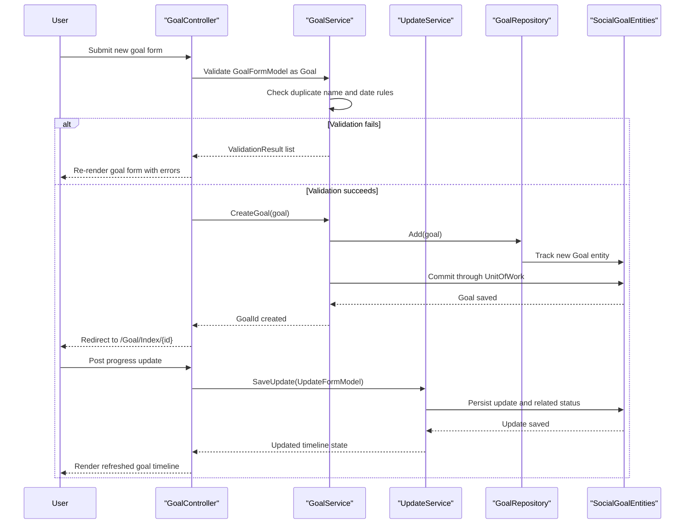

# API & Service Communication Contracts

SocialGoal exposes a broad MVC controller surface rather than a standalone REST API. Communication is predominantly synchronous and in-process: browser requests flow through MVC controllers into services, repositories, and the shared database, with selected JSON endpoints and email side effects.

## Service Catalog

| Service | Port | Category | Purpose |
|---|---|---|---|
| SocialGoal.Web | IIS hosted, no explicit port in repo | API Layer | Main MVC application serving HTML, partial views, and JSON endpoints |
| SocialGoal.Service | In-process library | Business | Encapsulates goal, group, user, invitation, notification, and follow workflows |
| SocialGoal.Data | In-process library | Infrastructure | Provides repositories, UnitOfWork, and the EF6 DbContext |
| SocialGoal.Web.Core | In-process library | Infrastructure | Supplies authentication wrappers, filters, extensions, and helper types |

## API Endpoints Inventory

| Service | Method | Path | Request Type | Response Type |
|---|---|---|---|---|
| AccountController | GET, POST | `/Account/Login` | Query `returnUrl`; body `LoginViewModel` | Login view or redirect to the requested page |
| AccountController | GET, POST | `/Account/Register` | Body `RegisterViewModel` | Registration view, created user session, or validation errors |
| AccountController | GET, POST | `/Account/Manage` | Body `ManageUserViewModel` | Account management view and password-change result |
| AccountController | GET, POST | `/Account/EditProfile` | Body `UserProfileFormModel` | Profile edit view or redirect to the profile page |
| AccountController | GET, POST | `/Account/UploadImage` | Body `UploadImageViewModel` | Upload view or redirect after image processing |
| AccountController | GET | `/Account/UserProfile/{id}` | Path `id` | HTML profile view |
| AccountController | GET | `/Account/FollowRequest`, `/Account/AcceptRequest`, `/Account/RejectRequest`, `/Account/Unfollow` | Query and path identifiers | Redirects reflecting follow workflow state |
| GoalController | GET, POST | `/Goal/Create`, `/Goal/Edit/{id}`, `/Goal/Delete/{id}` | Body `GoalFormModel`; path `id` | Goal forms, validation results, or redirects |
| GoalController | GET | `/Goal/Index/{id}`, `/Goal/GoalList`, `/Goal/ListOfGoals` | Path and query filters | Full goal pages and paged goal listings |
| GoalController | POST | `/Goal/SaveUpdate`, `/Goal/SaveComment` | Body `UpdateFormModel` or `CommentFormModel` | Redirects or partial-view refresh flows |
| GoalController | GET | `/Goal/DisplayUpdates/{id}`, `/Goal/DisplayComments/{updateId}`, `/Goal/Supporters/{id}` | Path `id` | Partial views or full views |
| GoalController | GET | `/Goal/SearchUser`, `/Goal/GetGoalReport`, `/Goal/DisplayCommentCount`, `/Goal/DisplayUpdateSupportCount` | Query parameters | `JsonResult` payloads for UI widgets |
| GoalController | GET | `/Goal/SupportGoalNow/{id}`, `/Goal/SupportInvitation/{goalId}` | Path `id` | Redirects or partial views for support flows |
| GroupController | GET, POST | `/Group/CreateGroup`, `/Group/EditGroup/{id}`, `/Group/DeleteGroup/{id}` | Body `GroupFormModel`; path `id` | Group forms, validation results, or redirects |
| GroupController | GET, POST | `/Group/CreateGoal`, `/Group/EditGoal/{id}`, `/Group/DeleteGoal/{id}` | Body `GroupGoalFormModel`; path `id` | Group-goal forms and redirects |
| GroupController | GET, POST | `/Group/CreateFocus`, `/Group/EditFocus/{id}`, `/Group/DeleteFocus/{id}` | Body `FocusFormModel`; path `id` | Focus forms and redirects |
| GroupController | GET | `/Group/Index/{id}`, `/Group/Members/{id}`, `/Group/ShowAllRequests/{id}`, `/Group/GroupList` | Path and query filters | Full group views and paged listings |
| GroupController | POST | `/Group/SaveUpdate`, `/Group/SaveComment` | Body `GroupUpdateFormModel` or `GroupCommentFormModel` | Redirects or partial-view refresh flows |
| GroupController | GET | `/Group/JoinGroup/{id}`, `/Group/GroupJoinRequest/{id}`, `/Group/AcceptRequest`, `/Group/RejectRequest` | Path and query identifiers | Redirects for membership workflow |
| GroupController | GET | `/Group/SearchUserForGroup`, `/Group/GetGoalReport`, `/Group/DisplayCommentCount`, `/Group/DisplayUpdateSupportCount` | Query parameters | `JsonResult` payloads for UI widgets |
| SearchController | GET | `/Search/SearchAll` | Query `searchText` | Search results view |
| NotificationController | GET | `/Notification/Index` | Query `page` | Notification list view or partial view |
| EmailRequestController | GET | `/EmailRequest/AddGroupUser`, `/EmailRequest/AddSupportToGoal` | TempData token seeded from registration flow | Redirect after token redemption |

## Management & Observability Endpoints

| Service | Endpoint | Custom Metrics (if any) |
|---|---|---|
| SocialGoal.Web | `/elmah` | No custom telemetry metrics detected; ELMAH exposes the error log UI |
| SocialGoal.Web | None detected for health or swagger | No health check, OpenAPI, or metrics endpoint found |

## DTOs & Contracts

The application uses MVC view models rather than immutable API contracts. Request bodies are typically classes such as `LoginViewModel`, `RegisterViewModel`, `ManageUserViewModel`, `GoalFormModel`, `UpdateFormModel`, `CommentFormModel`, `GroupFormModel`, `GroupGoalFormModel`, `FocusFormModel`, `GroupUpdateFormModel`, and `GroupCommentFormModel`, while responses are usually Razor views, partial views, redirects, or small `JsonResult` payloads for counts and autocomplete data. Domain entities such as `Goal`, `Group`, `Update`, `Comment`, `Support`, and invitation models remain service-level types; AutoMapper bridges them to UI-facing models. No OpenAPI definition, GraphQL schema, protobuf schema, or C# record-based immutable contracts were detected. JSON serialization support comes from the MVC stack with `Newtonsoft.Json` present as a package dependency.

## Communication Patterns

Communication is synchronous and entirely in-process for the core workload: MVC controllers call service interfaces, services call repositories, repositories use `SocialGoalEntities`, and the database commit happens through `IUnitOfWork`. No asynchronous messaging, queue integration, service discovery, client-side load balancing, circuit breaker, retry, or timeout policy framework was detected in the repository. The only notable side effect outside the database is email delivery via `UserMailer`, which generates invitation, support, welcome, and password-reset messages. Security posture is implemented at the API surface with `[Authorize]`, a custom `SocialGoalAuthorizeAttribute`, OWIN cookie authentication, and ASP.NET Identity; Google external login is enabled. No explicit HTTPS or TLS enforcement was found in `Web.config` or startup code, so transport security appears to depend on the hosting environment rather than the application itself.

## Service Technology Matrix

| Service | Web | Data Access | Discovery | Gateway | Actuator | Cache | Metrics |
|---|---|---|---|---|---|---|---|
| SocialGoal.Web | ASP.NET MVC 5 | Via service layer | None | None | None | None detected | Business report widgets only |
| SocialGoal.Service | None | Repository interfaces over EF6 | None | None | None | None detected | Domain metrics service, not ops telemetry |
| SocialGoal.Data | None | Entity Framework 6 | None | None | None | None detected | None |
| SocialGoal.Web.Core | MVC filters and helpers | None | None | None | None | None detected | None |

## Service Communication Sequence

