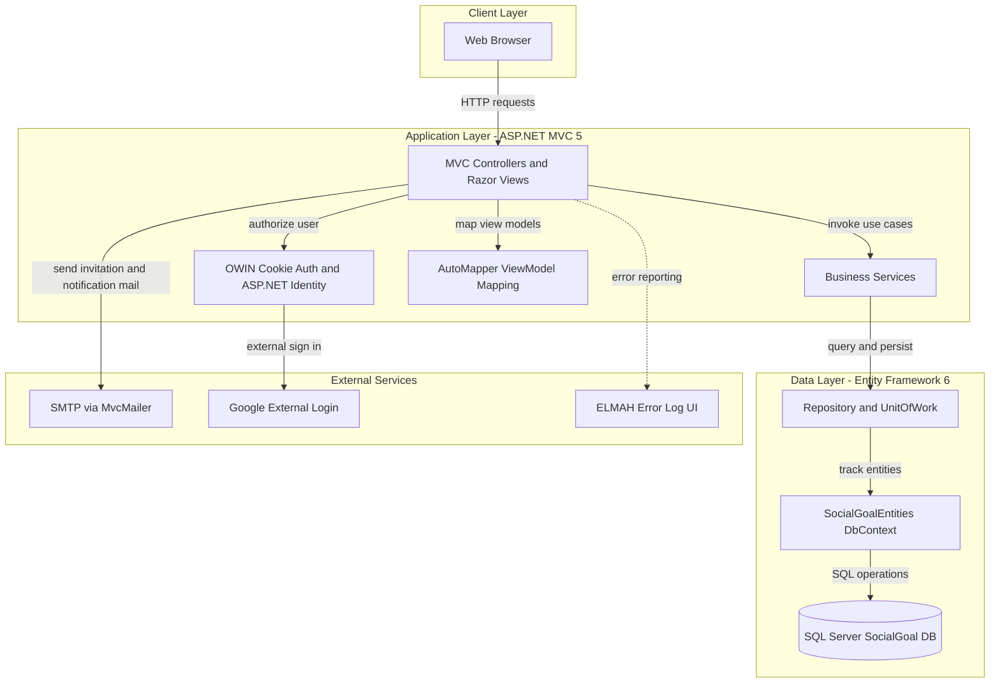
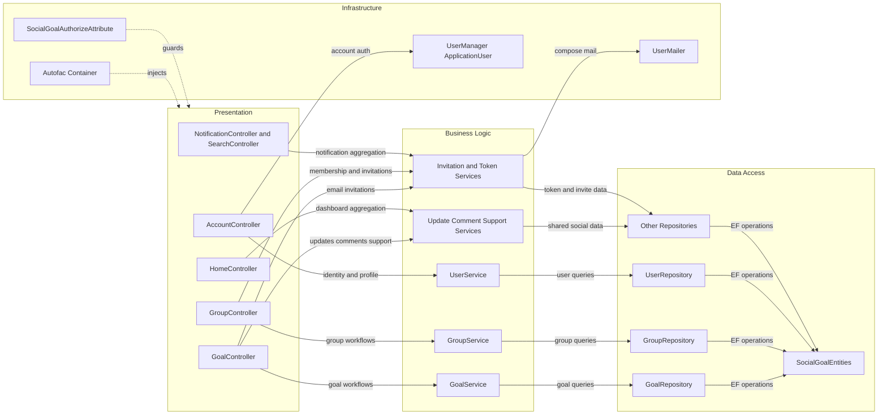

# Architecture Diagram

This document summarizes the SocialGoal application structure as a single ASP.NET MVC application backed by supporting class libraries. It focuses on the major runtime layers and the main component relationships inside the solution.

## Application Architecture

### Technology Stack Summary

| Layer | Technology | Version | Purpose |
|---|---|---:|---|
| Presentation | ASP.NET MVC | 5.0.0 | Server-rendered web UI and controller routing |
| Presentation | Razor and WebPages | 3.0.0 | View rendering |
| Application | SocialGoal.Service | Project library | Goal, group, user, notification, and invitation use cases |
| Application | AutoMapper | 3.1.1-ci1000 | Domain-to-view-model mapping |
| Security | ASP.NET Identity and OWIN | 1.0.0 / 2.0.0 | Cookie authentication and external login support |
| Data Access | Repository plus UnitOfWork | Project pattern | Encapsulates queries and commits |
| Persistence | Entity Framework | 6.0.2-beta1 | ORM over the SQL Server schema |
| Database | SQL Server | Not pinned | Primary relational data store |
| Infrastructure | Autofac | 3.1.5 | Per-request dependency injection |
| Operations | ELMAH | 1.2.2 / 2.1.1 | Error logging and browser-accessible error UI |

### Data Storage & External Services

The application persists its business data in a single SQL Server database through `SocialGoalEntities`, which includes both ASP.NET Identity tables and the social-goal domain entities. External integrations are limited to optional Google sign-in, SMTP-based email delivery through MvcMailer, and the ELMAH diagnostics endpoint used for operational troubleshooting.

### Key Architectural Decisions

- The solution follows a classic layered MVC design: controllers orchestrate requests, services enforce business rules, and repositories isolate persistence concerns.
- Autofac registers repositories, services, and authentication helpers by convention with per-request lifetimes, which keeps controller construction centralized.
- Collaboration features such as group invitations and goal support invitations are implemented inside the monolith with token-based email workflows rather than separate services.

## Component Relationships

### Component Inventory

| Component | Layer | Type | Responsibility |
|---|---|---|---|
| HomeController | Presentation | MVC Controller | Builds the authenticated user dashboard and notification feed |
| GoalController | Presentation | MVC Controller | Manages personal goals, updates, comments, support, and reports |
| GroupController | Presentation | MVC Controller | Manages groups, group goals, memberships, and invitations |
| AccountController | Presentation | MVC Controller | Handles sign-in, registration, profile editing, follows, and image uploads |
| NotificationController | Presentation | MVC Controller | Aggregates invitations, follow requests, and support notifications |
| GoalService | Business Logic | Service | Applies goal validation, filtering, and persistence rules |
| GroupService | Business Logic | Service | Creates groups, enforces unique names, and manages admin membership |
| UserService | Business Logic | Service | Provides user lookup and profile update operations |
| Invitation and Token Services | Business Logic | Service cluster | Supports share links, group invites, and goal support invites |
| GoalRepository | Data Access | Repository | Provides goal paging, filtering, and persistence methods |
| GroupRepository | Data Access | Repository | Persists group aggregates and lookup operations |
| SocialGoalEntities | Data Access | EF DbContext | Maps the relational model and commits entity changes |
| SocialGoalAuthorizeAttribute | Infrastructure | MVC Filter | Redirects unauthenticated or unauthorized users to account pages |
| UserMailer | Infrastructure | Mailer | Sends welcome, invitation, support, and password reset emails |
