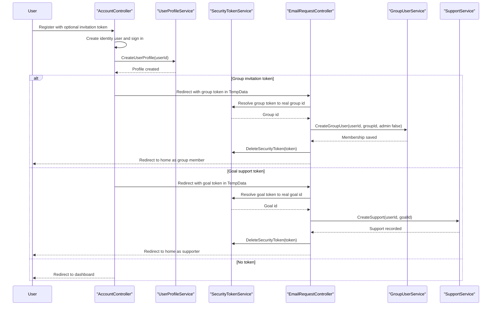

# Core Business Workflows

SocialGoal is a collaboration application for users who want to create personal goals, share progress, support other people, and organize related work inside groups. The main business value comes from combining goal tracking, social interaction, invitations, and membership workflows inside one authenticated experience.

## Domain Entities

| Entity | Service / Bounded Context | Description | Key Relationships |
|---|---|---|---|
| ApplicationUser | User Management | Authenticated person who owns goals, follows others, and joins groups | Creates goals, submits follow requests, participates in groups |
| UserProfile | User Management | Extended profile information for a user account | Linked to application user profile management |
| Goal | Personal Goal Tracking | Individual goal created by a user with dates, metric, status, and target | Owned by a user; has updates, supports, and invitations |
| Update | Personal Goal Tracking | Progress entry recorded against a goal | Belongs to a goal; has comments and support reactions |
| Comment | Social Collaboration | Discussion item on a goal update | Belongs to an update |
| Support | Social Collaboration | Signal that another user is supporting a goal | Connects a user to a goal |
| Group | Group Collaboration | Shared space for collaborative work around a topic | Has members, focus areas, requests, and group goals |
| GroupUser | Group Collaboration | Membership record linking a user to a group | Marks admins and work owners |
| GroupGoal | Group Collaboration | Goal tracked within a group and optionally assigned to a member | Belongs to a group and group member; has updates |
| GroupUpdate and GroupComment | Group Collaboration | Progress and discussion records for group goals | Mirror the personal goal workflow inside groups |
| FollowUser and FollowRequest | Social Network | Relationships that drive personalized feeds and approvals | Connect one application user to another |
| SecurityToken and Invitations | Invitation Workflow | Shareable tokens for joining groups, supporting goals, or resetting passwords | Bridge email workflows back into authenticated actions |

## Service-to-Domain Mapping

| Service | Domain Context | Owned Entities | External Dependencies |
|---|---|---|---|
| `UserService`, `UserProfileService` | User Management | `ApplicationUser`, `UserProfile` | ASP.NET Identity, follow services |
| `GoalService`, `GoalStatusService`, `MetricService` | Personal Goal Tracking | `Goal`, `GoalStatus`, `Metric` | `UpdateService`, `SupportService`, repositories |
| `UpdateService`, `CommentService`, `SupportService`, `UpdateSupportService` | Personal Goal Collaboration | `Update`, `Comment`, `Support`, `UpdateSupport` | `GoalService`, `UserService` |
| `GroupService`, `GroupUserService`, `GroupGoalService` | Group Collaboration | `Group`, `GroupUser`, `GroupGoal` | `FocusService`, `GoalStatusService`, `UserService` |
| `GroupUpdateService`, `GroupCommentService`, `GroupUpdateSupportService`, `GroupUpdateUserService` | Group Goal Collaboration | `GroupUpdate`, `GroupComment`, `GroupUpdateSupport`, `GroupUpdateUser` | `GroupGoalService`, `UserService` |
| `FollowUserService`, `FollowRequestService` | Social Network | `FollowUser`, `FollowRequest` | `UserService` |
| `GroupInvitationService`, `SupportInvitationService`, `SecurityTokenService` | Invitation Workflow | `GroupInvitation`, `SupportInvitation`, `SecurityToken` | `UserMailer`, `EmailRequestController` |

## Primary Workflows

### Workflow 1: Register a user and complete an invitation flow

1. An anonymous visitor opens `/Account/Login` or `/Account/Register`; if a shared token is present, the controller stores it in `SocialGoalSessionFacade.JoinGroupOrGoal`.
2. `AccountController.Register` creates the ASP.NET Identity user and immediately creates a `UserProfile` through `UserProfileService`.
3. After sign-in, the controller checks whether the stored token starts with `gr:` or `go:`.
4. For a group token, control moves to `EmailRequestController.AddGroupUser`, which resolves the true group id from `SecurityTokenService`, creates a `GroupUser` membership, deletes the token, and redirects home.
5. For a goal token, `EmailRequestController.AddSupportToGoal` resolves the goal id, creates a `Support` record, deletes the token, and redirects home.

### Workflow 2: Create and maintain a personal goal

1. An authenticated user opens `/Goal/Create` to load available metrics and statuses.
2. On submit, `GoalController.Create` maps the form model into `Goal` and calls `GoalService.CanAddGoal`.
3. The service enforces business rules such as unique goal names and valid start/end dates; if editing, it also checks that update dates still fall inside the adjusted schedule.
4. If valid, `GoalService.CreateGoal` persists the goal and commits the transaction.
5. The user later posts updates through `/Goal/SaveUpdate`, adds discussion through `/Goal/SaveComment`, and can invite supporters by email through token-backed invitation services.

### Workflow 3: Create a group and collaborate on group goals

1. An authenticated user posts `/Group/CreateGroup` with a `GroupFormModel`.
2. `GroupService.CanAddGroup` blocks duplicate group names; `GroupService.CreateGroup` persists the new `Group`.
3. The same service immediately creates a matching `GroupUser` record with `Admin = true`, making the creator the initial administrator.
4. Members can then create focus areas and group goals, post group updates and comments, and process join requests or invitations.
5. Group listings are filtered into all groups, my groups, followings' groups, and joined groups to support different collaboration views.

## Cross-Service Data Flows

Although the solution is split into multiple projects, the business data flow is monolithic and in-process. Controllers aggregate data from several services to produce dashboard and notification views: for example, `HomeController` and `NotificationController` combine goal activity, comments, invitations, follow requests, and user lookups into one response model. Invitation flows cross contexts by converting `SecurityToken` entries into concrete `GroupUser` or `Support` records after registration. There is no circuit breaker or remote-service fallback logic because the application does not call downstream HTTP services; the main degradation mode is database or mail unavailability.

## Business Workflow Sequence

## Business Rules & Decision Logic

- Goal names and group names must be unique within their respective contexts.
- Goal dates must be logically ordered, and edited goal dates must remain compatible with any already-recorded progress updates.
- The creator of a group automatically becomes the first admin member; if the follow-up membership creation fails, group creation is rolled back by deleting the new group.
- Invitation tokens are one-time workflow artifacts: they are resolved into a concrete business action and then removed.
- Personalized feeds depend on social relationships: a user can filter goals and groups by ownership, followed users, and supported or joined items.
- Authorization is business relevant across the whole system because almost every controller is marked `[Authorize]`; unauthenticated users are redirected to login and unauthorized users to an access-denied route.
- Unit-of-work commits define transaction boundaries for most create, edit, and delete operations, while the application relies on ELMAH and MVC error handling for exception visibility rather than explicit saga or compensation patterns.
