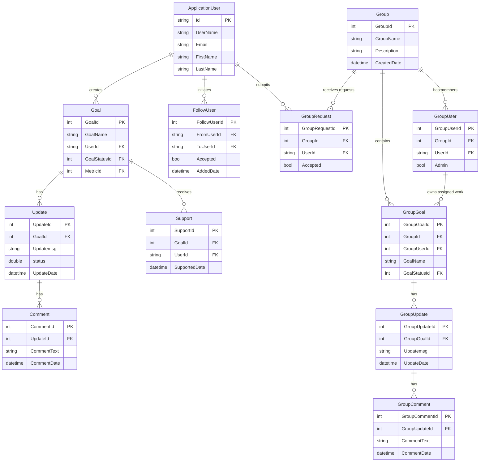

# Data Architecture & Persistence Layer

The SocialGoal data layer is centered on a single Entity Framework 6 `DbContext` that stores both identity data and the collaboration domain. The persistence model contains more than twenty entity sets covering users, goals, groups, updates, comments, supports, invitations, and follow relationships.

## Database Configuration

| Service/Module | DB Type | Profile | Driver | Connection | Migration Tool |
|---|---|---|---|---|---|
| SocialGoal.Web | SQL Server | Default web runtime | `System.Data.SqlClient` through EF6 | Named connection `SocialGoalEntities` in `Web.config`; integrated security to local SQL Server | None detected |
| SocialGoal.Data | SQL Server provider configuration | Shared library runtime | EF6 SQL Server provider | Uses the host application's named connection at runtime | None detected |
| SocialGoal.Tests | SQL Server provider configuration only | Test runtime | EF6 SQL Server provider | No dedicated test connection string in repo; falls back to host configuration if executed | None detected |

## Data Ownership per Service

| Service | Tables Owned | ORM Framework | Caching | Notes |
|---|---|---|---|---|
| SocialGoal.Data | Goals, Groups, Users, Profiles, Updates, Comments, Supports, Invitations, Requests, Follows, Metrics, Focuses, Status tables | Entity Framework 6 | None detected | Single shared schema exposed through repositories and `SocialGoalEntities` |
| SocialGoal.Service | Logical ownership of goal, group, user, and collaboration aggregates | Entity Framework 6 via repositories | None detected | Applies business rules but does not own a separate physical store |
| SocialGoal.Web | None directly | MVC model binding over service layer | None detected | Orchestrates workflows on top of the shared persistence model |

## Entity Model

## Key Repository Methods

| Service | Repository | Notable Methods | Purpose |
|---|---|---|---|
| SocialGoal.Data | `IRepository<T>` / `RepositoryBase<T>` | `Add`, `Update`, `Delete`, `Get`, `GetMany`, `GetPage` | Shared CRUD and paging contract used by all repositories |
| SocialGoal.Data | `IGoalRepository` / `GoalRepository` | `GetGoalsByPage(string userId, int currentPage, int noOfRecords, string sortBy, string filterBy)` | Applies goal-specific filtering for personal, following, and supported goal feeds |
| SocialGoal.Data | `IGroupRepository` / `GroupRepository` | Inherits base CRUD and paging methods | Supports group lookups used by group listings and admin views |
| SocialGoal.Data | `IGroupUserRepository` / `GroupUserRepository` | Inherits base CRUD methods | Persists group membership and admin ownership links |
| SocialGoal.Data | `IFollowUserRepository` / `FollowUserRepository` | Inherits base CRUD methods | Tracks follower relationships used to build personalized feeds |

## Caching Strategy

| Scope | Provider | TTL / Eviction | Pattern | Notes |
|---|---|---|---|---|
| Application runtime | None detected | Not applicable | Direct database access | No memory cache, distributed cache, or second-level EF cache configuration was found |
| Session and auth | ASP.NET auth cookie only | Controlled by forms and OWIN cookie settings | Session-style identity cookie | Used for authentication state, not for domain data caching |

## Data Ownership Boundaries

SocialGoal uses a shared-database monolith model. All modules ultimately read and write the same SQL Server database through a single `SocialGoalEntities` context, and cross-module collaboration happens through in-process service calls plus repository access rather than service-to-service APIs. There is no CQRS split, no read replica pattern, and no database-per-module isolation; feeds and dashboard views are composed by querying multiple repositories and then projecting the data into MVC view models.

### Data Classification & Sensitivity

| Entity | Sensitive Fields | Classification | Controls in Place |
|---|---|---|---|
| ApplicationUser | `Email`, `FirstName`, `LastName`, `ProfilePicUrl` | PII | Authentication and authorization are present; no field-level masking or encryption settings found |
| UserProfile | Personal profile details maintained by `UserProfileService` | PII | No explicit masking or encryption configuration found in the repository |
| FollowUser and GroupUser | User identifiers and relationship membership | PII | Access limited through authenticated workflows; no extra data protection settings detected |
| Goal, Group, Update, Comment | User-generated content and timestamps | None to low sensitivity | Standard application authorization only |
| SecurityToken | Share and reset tokens | Sensitive application secret material | Tokens are persisted and later deleted, but no encryption-at-rest configuration is declared in the repo |
