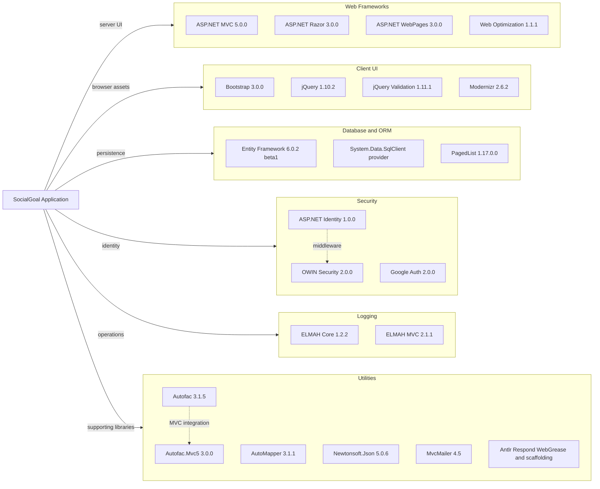

# Dependency Map

This document inventories the declared package dependencies for SocialGoal. The solution contains 37 application package references in the web project and 10 package references in the test project, with most runtime behavior concentrated in the MVC web application.

## Dependencies

### Dependency Summary

| Category | Count | Key Libraries | Notes |
|---|---:|---|---|
| Web Frameworks | 4 | ASP.NET MVC, Razor, WebPages, Web Optimization | Legacy ASP.NET MVC 5 stack on .NET Framework 4.5 |
| Client UI | 4 | Bootstrap, jQuery, jQuery Validation, Modernizr | Static client assets are bundled with the web app |
| Database and ORM | 3 | Entity Framework, SqlClient provider, PagedList | EF6 plus paging helpers drive repository queries |
| Security | 6 | ASP.NET Identity, OWIN, Google and other auth providers | Cookie auth and optional external sign-in support |
| Logging | 2 | ELMAH Core, ELMAH MVC | Browser-accessible diagnostics endpoint is enabled |
| Utilities | 8+ | Autofac, AutoMapper, Newtonsoft.Json, MvcMailer | Includes DI, object mapping, JSON, email, and older build helpers |

### Version & Compatibility Risks

The dependency stack is materially dated: the web project targets .NET Framework 4.5, uses ASP.NET MVC 5.0.0, ASP.NET Identity 1.0.0, and an early Entity Framework 6 beta package. These libraries are stable for legacy workloads but have clear modernization and compatibility risks when moving toward current .NET releases such as `net10.0`.

### Notable Observations

- Most packages are concentrated in the web project; the class libraries rely mainly on project references rather than separate package graphs.
- Authentication support includes multiple external providers, but only Google is enabled in code while the other provider packages remain referenced.
- `EntityFramework` is declared as `6.0.2-beta1` in the web project, which is unusually old for a production dependency.
- Several utility packages such as `T4Scaffolding.Core`, `Respond`, and `WebGrease` indicate an older ASP.NET MVC tooling generation.

## Test Dependencies

| Framework | Version | Notes |
|---|---:|---|
| NUnit | 2.6.3 | Primary unit testing framework in `SocialGoal.Tests` |
| Moq | 4.1.1311.0615 | Mocking framework for controller and service tests |
| EntityFramework | 6.0.0 | Reused in tests to work against persistence abstractions |
| ASP.NET Identity Core and EntityFramework | 1.0.0 | Required for account and identity-oriented tests |
| Microsoft.Owin and Microsoft.Owin.Security | 2.0.0 | Used by authentication-oriented tests |
| AutoMapper | 3.1.1-ci1000 | Mirrors production mapping behavior in tests |
| MvcMailer | 4.5 | Supports tests around mail workflows |

Total test-scope dependencies: 10

The test project is centered on controller-style unit tests with NUnit and Moq. No integration-test or browser-test framework was detected, so modernization safety nets are relatively lightweight.
